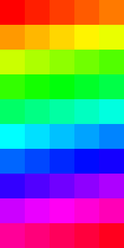

# Color Palette Creator

A C# WinUI app that extracts a usable color palette from a reference image. The repository contains the desktop app and the Python notebook that documents the original experiment.

## Build and run

Requires the .NET SDK and a Windows machine with WinUI support. Open the solution in Visual Studio, restore packages, and run the app. The exploratory Python implementation is in the notebook files beside the app.

The project is licensed under the terms in [LICENSE](LICENSE).
